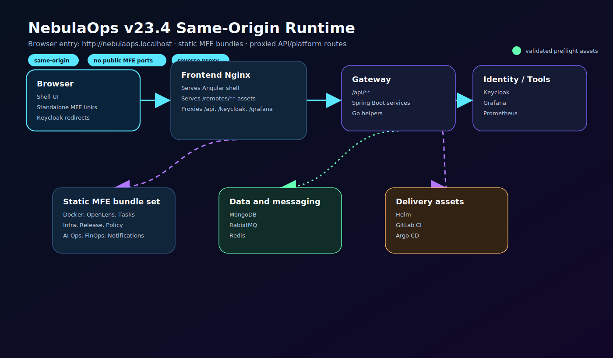
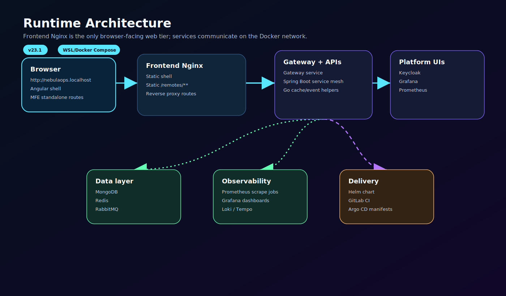
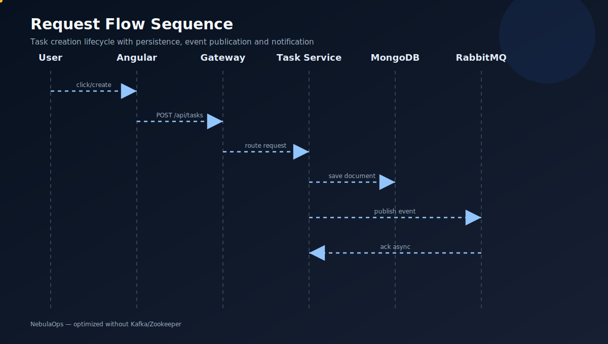

# Architecture

NebulaOps v23.4 uses a same-origin browser architecture. The only supported browser entry point is `http://nebulaops.localhost`.

## Runtime model

- The Angular shell is served by the frontend Nginx container.
- Micro frontend standalone pages and `remoteEntry.js` files are served as static files under `/remotes/**`.
- Application API calls use `/api/**` and are forwarded to the gateway service.
- Keycloak, Grafana and Prometheus are exposed through same-origin reverse-proxy routes.
- MongoDB, RabbitMQ and Redis provide state, asynchronous messaging and caching.
- Go services provide lightweight cache/event-worker capabilities.
- Helm, GitLab CI and Argo CD assets are included for deployment and GitOps workflows.

