# NebulaOps v14 — Personal DevOps Control Plane

NebulaOps v14 is a senior cloud-developer portfolio project designed to run on one personal machine with Docker
Desktop/WSL or Linux. It demonstrates a realistic microservice platform with an Angular operations console, Spring Boot
services, Go workers, MongoDB, RabbitMQ, Redis, Prometheus, Grafana, Helm, Kubernetes manifests, GitLab CI and Argo CD
examples.

## What is new in v14

- New Angular DevOps console with seven tabs: Overview, Tasks, Kubernetes, Observability, CI/CD, Security and Infra.
- Advanced Kubernetes resource view with CRUD, scaling, YAML live editor and expanded workload types.
- Microservice log console with manual refresh, service filter and automatic refresh interval.
- CI/CD visual pipeline for lint, test, build, Helm render and Argo CD sync gates.
- DevSecOps checklist with persisted local state.
- Local infrastructure map for MongoDB, RabbitMQ, Redis, Prometheus and Grafana.
- Professional documentation and complex animated SVG architecture diagrams.
- Single-machine execution model: no cloud subscription required.

## Architecture



```text
Browser / Angular Console
        |
Nginx frontend container
        |
Spring Boot Gateway  ---- kubectl + Docker socket integration
        |
  -------------------------------------------------
  | Auth | Task | File | Notification | Go Cache | Go Worker |
  -------------------------------------------------
        |
MongoDB + RabbitMQ + Redis + Prometheus + Grafana
```

## Prerequisites

- Windows 11 with WSL2 Ubuntu or Linux/macOS.
- Docker Desktop with WSL integration enabled, or Docker Engine on Linux.
- Docker Compose plugin.
- Optional: kubectl, kind/minikube, Helm and Argo CD CLI for Kubernetes workflows.

## Run locally

```bash
cd nebulaops-v14
cp .env.example .env
./scripts/local-up.sh
```

Open:

- Frontend: http://localhost:4200
- Gateway API: http://localhost:8080
- RabbitMQ: http://localhost:15672 (guest/guest)
- Prometheus: http://localhost:9090
- Grafana: http://localhost:3000 (admin/admin)

Stop everything:

```bash
./scripts/local-down.sh
```

## WSL recommended flow

```bash
mkdir -p ~/projects
cp -r /mnt/d/workspace/personal/portfolio/nebulaops-v14 ~/projects/nebulaops-v14
cd ~/projects/nebulaops-v14
./scripts/wsl/check-wsl.sh
./scripts/wsl/start.sh
```

## Smoke test

```bash
./scripts/smoke-test.sh
./scripts/verify-local.sh
```

## Documentation index

- [Technical documentation](docs/TECHNICAL_DOCUMENTATION.md)
- [v14 architecture](docs/V14_ARCHITECTURE.md)
- [Operations runbook](docs/V14_OPERATIONS_RUNBOOK.md)
- [Kubernetes and Helm guide](docs/HELM_GUIDE.md)
- [Grafana observability](docs/GRAFANA_OBSERVABILITY.md)
- [Troubleshooting](docs/TROUBLESHOOTING.md)

## Project owner

Developed by Peyman Eshghi Malayeri for a senior Cloud/DevOps portfolio.

## Diagram catalog

- `docs/diagrams/runtime-architecture.svg`
- `docs/diagrams/gitlab-argocd-flow.svg`
- `docs/diagrams/messaging-cache-flow.svg`
- `docs/diagrams/kubernetes-helm-view.svg`
- `docs/diagrams/request-flow-sequence.svg`
- `docs/diagrams/service-port-map.svg`
- `docs/diagrams/nebulaops-v14-advanced-architecture.svg`
