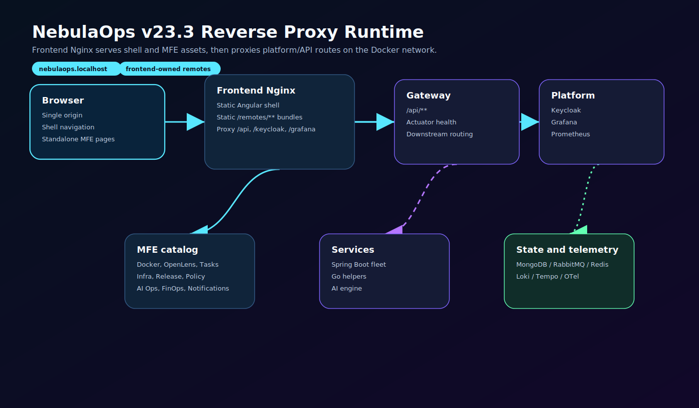

# Technical documentation

## Scope

This document describes the current NebulaOps v23.3 local runtime. The platform is designed around a single browser-facing origin, `http://nebulaops.localhost`, with the frontend Nginx container serving static shell/MFE files and proxying API and platform routes into the Docker network.

## Frontend shell and remotes

The Angular shell loads each MFE as a custom element from a same-origin remote entry. Standalone MFE pages are also served from the same origin.

```text
/remotes/<mfe>/remoteEntry.js
/remotes/<mfe>/
```

This avoids cross-origin token sharing problems, removes browser-facing MFE service ports and keeps Keycloak redirects, localStorage and route handling under one origin.

## Reverse proxy routing

| Public path | Internal target |
| --- | --- |
| `/` | static Angular shell in the frontend Nginx image |
| `/remotes/**` | static MFE bundles copied into the frontend Nginx image |
| `/api/**` | `gateway-service:8080` |
| `/actuator/**` | `gateway-service:8080` |
| `/keycloak/**` | Keycloak container |
| `/grafana/**` | Grafana container |
| `/prometheus/**` | Prometheus container |

The gateway routes application requests to Spring Boot services and Go helpers. Runtime data is stored or exchanged through MongoDB, RabbitMQ and Redis. Observability is provided by Prometheus, Grafana, Loki, Tempo and OpenTelemetry Collector.

## Backend services

The Java backend uses Spring Boot services behind the gateway. The core services include auth, task, notification, file, AI Ops, DevSecOps, pipeline, observability, GitOps, environment management, Terraform, cost analytics, release orchestration, policy governance and audit. Go components provide cache and event-worker capabilities where lightweight runtime helpers are useful.

## Identity and security

Keycloak is exposed through the same public origin:

```text
/keycloak/**
```

The shell uses the same origin for redirect and logout callback handling. SSO proxy containers for RabbitMQ, Mongo Express and Redis Commander are optional and should be started only after the core runtime is healthy.

## Delivery and infrastructure

NebulaOps includes Docker Compose for local execution, WSL scripts for repeatable startup and diagnostics, a Helm chart for Kubernetes deployment packaging, GitLab CI assets for pipeline validation and Argo CD manifests for GitOps reconciliation. GitLab CE is intentionally optional because it is heavy for a local workstation.

## Observability

Grafana and Prometheus remain available through same-origin reverse proxy routes:

```text
/grafana/
/prometheus/
```

Loki and Tempo remain internal runtime services unless directly exposed by the compose profile.

## Canonical diagrams





## Progressive Delivery Center

The v23.3 Progressive Delivery Center provides runtime canary/blue-green operations backed by `progressive-delivery-service`. It queries Argo Rollouts, Argo CD and Kubernetes at request time and exposes gateway routes under `/api/progressive-delivery/**`.
