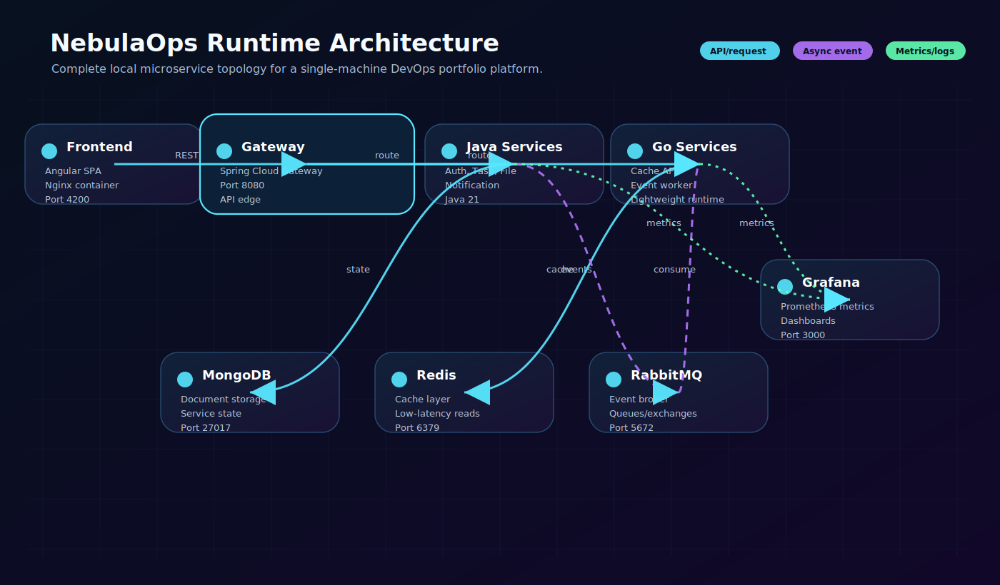
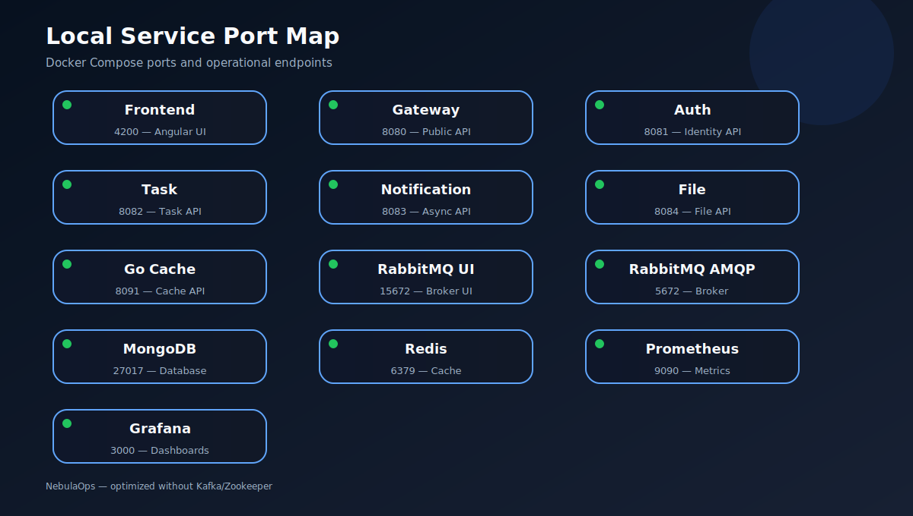
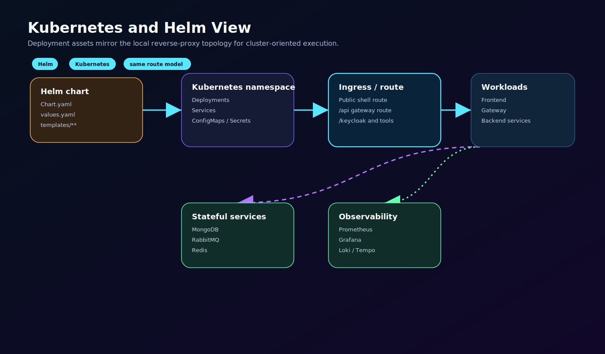
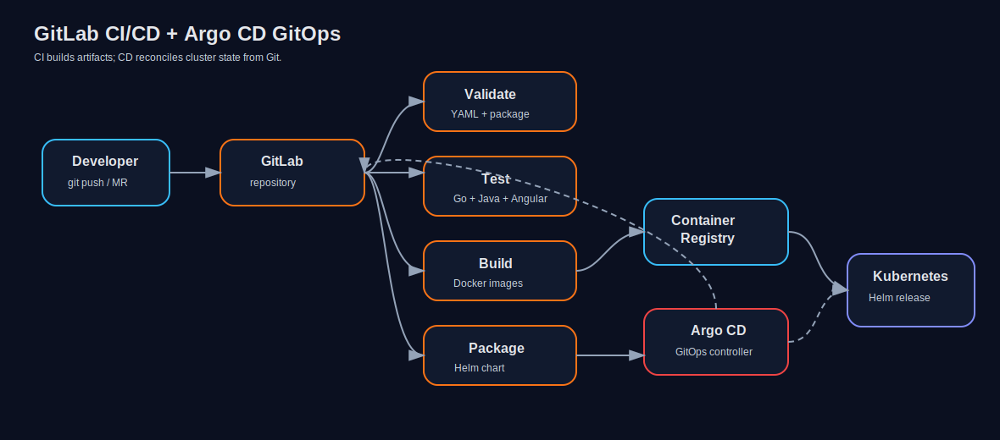

# NebulaOps Technical Documentation

## 1. Purpose

NebulaOps is a professional cloud-native portfolio platform designed to demonstrate modern distributed-system
engineering without unnecessary local runtime complexity. It uses RabbitMQ as the single messaging layer and avoids
Kafka/Zookeeper to keep Docker Desktop and WSL2 execution reliable.

## 2. System context

The platform represents an operations-oriented SaaS application. Users interact with an Angular dashboard, requests
enter through an API gateway, domain services handle business capabilities, MongoDB stores state, RabbitMQ transports
asynchronous events, Redis supports cache patterns, and Prometheus/Grafana provide observability.


## 3. Architectural principles

### 3.1 Clear service boundaries

Each backend service owns a bounded context. This reduces coupling and makes the system easier to evolve.

| Service              | Responsibility                       | Runtime                        |
|----------------------|--------------------------------------|--------------------------------|
| Gateway Service      | API routing and edge abstraction     | Java 21 / Spring Cloud Gateway |
| Auth Service         | User identity API foundation         | Java 21 / Spring Boot          |
| Task Service         | Task lifecycle and domain events     | Java 21 / Spring Boot          |
| File Service         | File metadata API foundation         | Java 21 / Spring Boot          |
| Notification Service | Event-driven notification processing | Java 21 / Spring Boot          |
| Go Cache Service     | Redis-backed cache API               | Go                             |
| Go Event Worker      | Lightweight event-worker foundation  | Go                             |

### 3.2 One broker, one responsibility model

RabbitMQ is responsible for asynchronous delivery. It provides exchanges, queues, routing keys, management UI and
operational simplicity. This is the right fit for local development and portfolio demonstration because the business
flows are command/event oriented and do not require large-scale stream replay.

### 3.3 Database ownership

MongoDB is used as the persistence layer. Services should own their collections and avoid direct cross-service database
coupling. Cross-service communication should happen through APIs or asynchronous events.

### 3.4 Observable by default

Services expose health and metrics endpoints. Prometheus scrapes runtime metrics and Grafana displays operational
dashboards. This allows the platform to be presented not only as code, but as an operated system.

## 4. Runtime architecture

```text
Browser
  -> Angular SPA
  -> Spring Cloud Gateway
  -> Domain services
  -> MongoDB
  -> RabbitMQ event queues
  -> Notification/worker consumers
  -> Redis cache services
  -> Prometheus/Grafana observability
```

## 5. Request lifecycle


A typical task creation flow:

1. Angular sends a task request to the gateway.
2. Gateway routes the request to Task Service.
3. Task Service validates and persists the task in MongoDB.
4. Task Service publishes a task event to RabbitMQ.
5. Notification Service consumes the event and processes a notification action.
6. Metrics are exposed and scraped by Prometheus.

## 6. Messaging and cache design



RabbitMQ handles:

- task-created events
- task-status-changed events
- notification queue delivery
- worker-friendly message routing
- future retry/dead-letter queue extension

Redis handles:

- hot lookup cache
- temporary runtime state
- low-latency service access
- future rate-limit or session-like primitives

## 7. Local runtime services



| Component            |  Port | Notes                            |
|----------------------|------:|----------------------------------|
| Frontend             |  4200 | Angular development/runtime UI   |
| Gateway              |  8080 | Public API entrypoint            |
| Auth Service         |  8081 | Internal/public service endpoint |
| Task Service         |  8082 | Task lifecycle API               |
| Notification Service |  8083 | Async processing API/health      |
| File Service         |  8084 | File metadata API                |
| Go Cache Service     |  8091 | Redis-backed cache API           |
| Pipeline Engine      |  8087 | CI/CD pipeline designer API      |
| MongoDB              | 27017 | Persistence                      |
| Mongo Express        |  8088 | MongoDB web console              |
| Redis                |  6379 | Cache                            |
| Redis Commander      |  8089 | Redis web console                |
| RabbitMQ AMQP        |  5672 | Broker protocol                  |
| RabbitMQ UI          | 15672 | Management dashboard             |
| Prometheus           |  9090 | Metrics collection               |
| Grafana              |  3000 | Dashboards                       |

## 8. Kubernetes and delivery



The Helm chart packages application workloads and platform configuration for Kubernetes-style deployment. Argo CD assets
define a GitOps delivery model where the desired state is stored in Git and continuously reconciled into the cluster.



## 9. Production hardening roadmap

Recommended next improvements:

- JWT authentication enforcement at the gateway
- service-to-service authentication
- centralized configuration management
- RabbitMQ dead-letter exchanges and retry queues
- MongoDB indexes per access pattern
- structured logging with trace correlation IDs
- OpenTelemetry tracing
- container image vulnerability scanning
- Kubernetes resource requests/limits
- production secrets through External Secrets or sealed secrets
- dashboard JSON provisioning for Grafana

## 10. Quality gates

Before presenting or deploying the project, run:

```bash
python3 scripts/validate-package.py
python3 scripts/validate-yaml.py
find scripts -name "*.sh" -print0 | xargs -0 -I{} bash -n {}
./scripts/test-all.sh
```

## Frontend operations and Kubernetes visibility

The Angular frontend has been extended into an operations console rather than a simple portfolio landing page. It
presents Kubernetes namespaces, pods, services, cluster summary metrics and sanitized microservice logs in the same
workspace as the delivery task board.

The frontend reads deterministic demo cluster data from `frontend/src/assets/k8s-snapshot.json`. This keeps the
portfolio runnable without requiring a live Kubernetes API server. In production, the same UI contract can be served by
a read-only platform endpoint such as `/api/platform/kubernetes/snapshot` backed by Kubernetes RBAC with `get`, `list`
and `watch` permissions for non-secret operational resources.

Task movement uses optimistic persistence. When backend tasks are available, drag-and-drop updates
call `PATCH /api/tasks/{id}/status/{status}` through Spring Cloud Gateway and the task-service persists the state in
MongoDB. If the backend is not reachable during a local demo, the board falls back to browser `localStorage`, preventing
task movements from being lost after refresh.

The production frontend image now includes Nginx API proxying for `/api/*` so browser calls reach the gateway service
from inside Docker Compose and Kubernetes-style service networking.

## NebulaOps v19.3 additions

NebulaOps v19.3 expands the operations surface with Angular tabs for Overview, Tasks, Kubernetes, Observability, CI/CD,
Security and Infra. It keeps MongoDB, RabbitMQ, Redis, Go services, Prometheus, Grafana, GitLab, Helm, Argo CD and WSL
execution aligned for a single-machine portfolio runtime.

Additional diagram catalog:

- `runtime-architecture.svg`
- `gitlab-argocd-flow.svg`
- `messaging-cache-flow.svg`
- `kubernetes-helm-view.svg`
- `request-flow-sequence.svg`
- `service-port-map.svg`
- `nebulaops-v19-3-advanced-architecture.svg`


## INFRA Hub MFE

NebulaOps v22.2 includes a dedicated `infra-hub` micro frontend on port `4220`. It restores the previous INFRA console experience as an independently deployable remote and links observability, data, runtime, gateway and GitOps endpoints.
